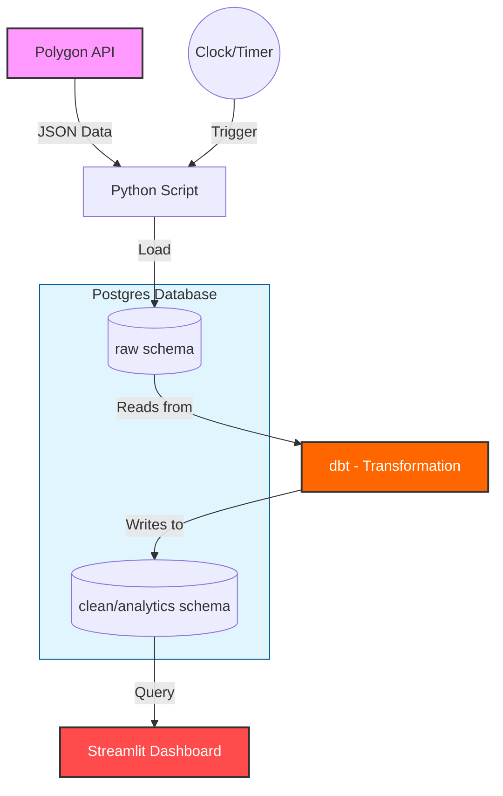

```mermaid
graph TD
    %% Source Layer
    Polygon[Polygon API] -- "JSON Data" --> Script[Python Script]
    
    %% Orchestration/Trigger
    Clock((Clock/Timer)) -- "Trigger" --> Script
    
    %% Storage & Transformation Layer (Postgres)
    subgraph Postgres_DB [Postgres Database]
        Raw[(raw schema)]
        Clean[(clean/analytics schema)]
    end
    
    Script -- "Load" --> Raw
    
    %% dbt Logic
    dbt[dbt - Transformation]
    Raw -- "Reads from" --> dbt
    dbt -- "Writes to" --> Clean
    
    %% Presentation Layer
    Clean -- "Query" --> Streamlit[Streamlit Dashboard]

    %% Styling
    style Polygon fill:#f9f,stroke:#333,stroke-width:2px
    style dbt fill:#ff6600,stroke:#333,stroke-width:2px,color:#fff
    style Streamlit fill:#ff4b4b,stroke:#333,stroke-width:2px,color:#fff
    style Postgres_DB fill:#e1f5fe,stroke:#01579b
```