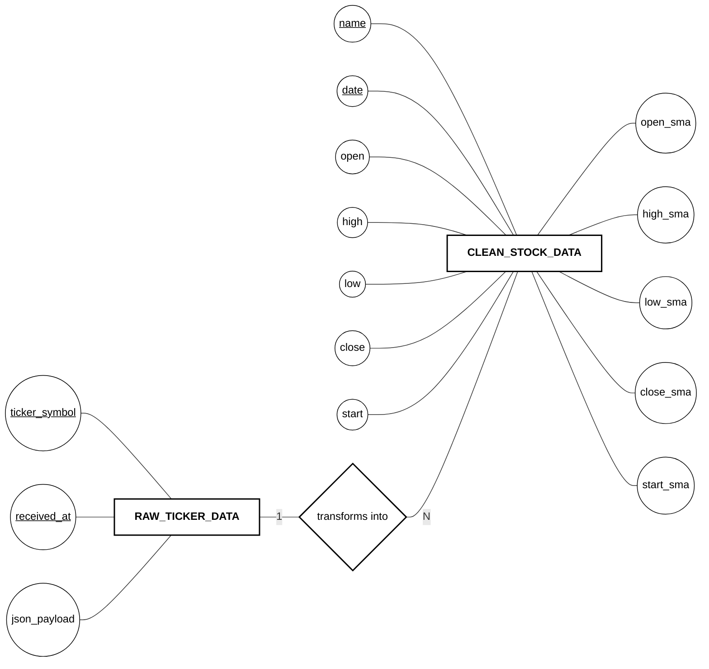

```mermaid
graph LR
    %% Entities (Rectangles)
    Ticker[RAW_TICKER_DATA]
    Stock[CLEAN_STOCK_DATA]

    %% Relationship (Diamond)
    Transform{transforms into}

    %% Ticker Attributes (Primary Keys Underlined)
    t1((<u>ticker_symbol</u>)) --- Ticker
    t2((<u>received_at</u>)) --- Ticker
    t3((json_payload)) --- Ticker

    %% Stock Attributes - Left Side (Keys & Price Points)
    s1((<u>name</u>)) --- Stock
    s2((<u>date</u>)) --- Stock
    s3((open)) --- Stock
    s4((high)) --- Stock
    s5((low)) --- Stock
    s6((close)) --- Stock
    s7((start)) --- Stock

    %% Stock Attributes - Right Side (Analytics)
    Stock --- sma1((open_sma))
    Stock --- sma2((high_sma))
    Stock --- sma3((low_sma))
    Stock --- sma4((close_sma))
    Stock --- sma5((start_sma))

    %% Connections
    Ticker ---|1| Transform
    Transform ---|N| Stock

    %% Strict Monochrome Styling (Black Text, White Background)
    classDef default color:#000,fill:#fff,stroke:#000;
    classDef entity font-weight:bold,stroke-width:2px;
    
    class Ticker,Stock entity;
    style Transform fill:#fff,stroke:#000,stroke-width:2px;
```